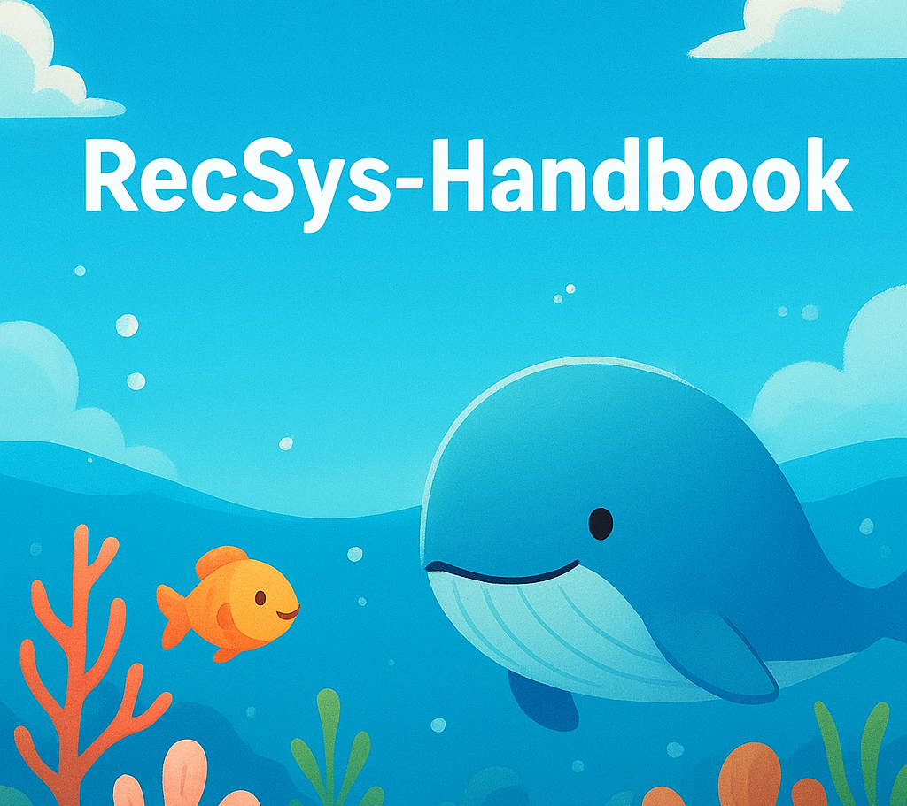

    
    <h1>RecSys-Handbook</h1>

[中文](./README.md)

  <h3>📚 从零开始的推荐系统原理与实践教程</h3>

---

## 🎯 项目介绍

### ✨ 你将收获什么？

## 📖 内容导航

### PDF 版本下载

## 💡 如何学习

## 🤝 如何贡献

我们欢迎任何形式的贡献！

- 🐛 **报告 Bug** - 发现问题请提交 Issue
- 💡 **功能建议** - 有好想法就告诉我们
- 📝 **内容完善** - 帮助改进教程内容
- 🔧 **代码优化** - 提交 Pull Request

## 🙏 致谢

  
⭐ 如果这个项目对你有帮助，请给我们一个 Star！

本作品采用[知识共享署名-非商业性使用-相同方式共享 4.0 国际许可协议](http://creativecommons.org/licenses/by-nc-sa/4.0/)进行许可。
